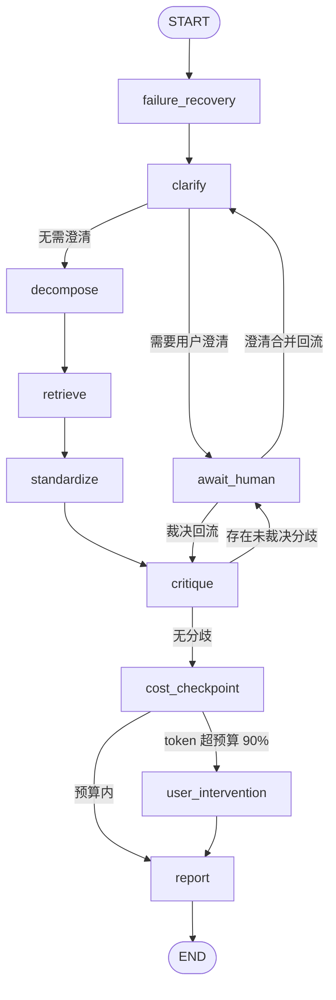

# AI 研究者助手 · 后端服务

多智能体深度研究平台的后端服务。用户提出研究问题后，系统通过 LangGraph 状态图编排多个智能体协同完成「澄清 → 拆解 → 检索 → 标准化 → 审视 → 报告」的完整研究链路，支持人机协同（HITL）、证据溯源、冲突裁决、成本治理与实时事件推送。

- 语言/运行时：Python 3.11 - 3.12（要求 >=3.11,<3.13）
- 包管理：[uv](https://docs.astral.sh/uv/)（锁定文件见 `uv.lock`）
- Web 框架：FastAPI + Uvicorn（异步）
- 当前里程碑：**M2-2 批判收敛与人机裁决已完成**（M1 2026-09-12 关闭；M2-1 意图路由、M2-2 LLM 语义冲突检测/落库/裁决 REST/PostgresSaver 跨请求恢复已完成，详见「里程碑与当前状态」）

---

## 目录

- [技术栈](#技术栈)
- [环境要求](#环境要求)
- [快速开始](#快速开始)
- [项目结构](#项目结构)
- [系统架构](#系统架构)
- [HTTP / WebSocket API](#http--websocket-api)
- [数据库与迁移](#数据库与迁移)
- [配置项参考](#配置项参考)
- [开发指南](#开发指南)
- [Docker 部署](#docker-部署)
- [里程碑与当前状态](#里程碑与当前状态)
- [常见问题](#常见问题)

---

## 技术栈

| 领域 | 选型 |
| --- | --- |
| Web 框架 | FastAPI、Uvicorn、ORJSON |
| 数据校验 | Pydantic v2、pydantic-settings |
| 数据库 | PostgreSQL 16 + pgvector、SQLAlchemy 2（asyncio）、Alembic |
| 智能体编排 | LangGraph 1.x、langchain-core 1.x、langchain-openai 1.x |
| 异步任务 | Celery 5、Redis 7 |
| 检索 / 抓取 | 博查（默认）/ Tavily、httpx、Playwright、trafilatura、readability-lxml |
| 对象存储 | MinIO（S3 兼容） |
| 鉴权 | JWT（python-jose、PyJWT、bcrypt） |
| 可观测性 | structlog、OpenTelemetry、请求级 trace_id |
| 文档处理 | python-docx、openpyxl、pypdf |
| 质量工具 | ruff、mypy（strict）、pytest、pytest-asyncio、pre-commit |

---

## 环境要求

开发机需准备：

1. **Python 3.11 或 3.12**（建议由 uv 自动管理，无需系统预装）
2. **uv**（依赖与虚拟环境管理）
3. **Docker Desktop**（用于本地一键启动 PostgreSQL、Redis、MinIO）
4. Windows / macOS / Linux 均可，本仓库开发环境以 Windows 为主

安装 uv（Windows PowerShell）：

```powershell
powershell -ExecutionPolicy ByPass -c "irm https://astral.sh/uv/install.ps1 | iex"
```

---

## 快速开始

以下命令均在 `backend/` 目录下执行。

### 1. 启动基础设施

本地依赖栈（PostgreSQL 16 + pgvector、Redis 7、MinIO）通过 Docker Compose 一键启动：

```powershell
docker compose -f docker-compose.dev.yml up -d
```

启动后的服务与端口：

| 服务 | 地址 | 凭据 |
| --- | --- | --- |
| PostgreSQL（含 pgvector） | `localhost:5432` | 库/用户/密码均为 `deep_research` |
| Redis | `localhost:6379` | 无 |
| MinIO API | `http://localhost:9000` | `minioadmin / minioadmin` |
| MinIO Console | `http://localhost:9001` | `minioadmin / minioadmin` |

低内存机器（如 16GB 且常驻 IDE/浏览器）可改用精简栈，只起 M1 联调唯一硬依赖 PostgreSQL（容器限额 384MB），并参考 `.wslconfig.example` 将 WSL2 虚拟机限制在 2GB：

```powershell
docker compose -f docker-compose.min.yml up -d
```

说明：MinIO 桶不会自动创建，请在 Console 中手动创建名为 `deep-research` 的桶（或使用 `mc mb` 命令）。

### 2. 配置环境变量

复制环境变量模板并按需修改：

```powershell
Copy-Item .env.example .env
```

`.env` 中以下字段**没有默认值，缺失时应用无法启动**，本地开发已由 `.env.example` 给出可用值：

`SECRET_KEY`、`DB_ASYNC_URL`、`DB_SYNC_URL`、`REDIS_URL`、`CELERY_BROKER_URL`、`CELERY_RESULT_BACKEND`、`OBJECT_STORAGE_ENDPOINT`、`OBJECT_STORAGE_ACCESS_KEY`、`OBJECT_STORAGE_SECRET_KEY`、`OBJECT_STORAGE_BUCKET`。

### 3. 安装依赖

```powershell
uv sync
```

uv 会自动下载匹配的 Python 解释器、创建虚拟环境并按 `uv.lock` 安装全部依赖（含 dev 工具组）。

### 4. 初始化数据库

```powershell
uv run alembic upgrade head
```

### 5. 写入联调种子账号

M1 阶段没有注册接口，迁移完成后全新数据库中没有任何用户，需执行种子脚本创建默认团队与首个可登录账号（按邮箱幂等，可重复执行；`APP_ENV=prod` 时拒绝执行）：

```powershell
uv run deep-research-seed
```

默认账号：`dev@example.com` / `Dev@123456`（可通过 `SEED_USER_EMAIL`、`SEED_USER_PASSWORD` 等环境变量覆盖，见 `.env.example`）。

### 6. 启动 API 服务

开发模式（带热重载）：

```powershell
uv run uvicorn app.main:app --reload
```

或使用已注册的脚本入口：

```powershell
uv run deep-research-api
```

### 7. 验证

- 健康检查：<http://localhost:8000/healthz>
- Swagger 文档：<http://localhost:8000/docs>
- ReDoc 文档：<http://localhost:8000/redoc>

### 8.（可选）启动 Celery Worker

M1 阶段研究流程在 API 进程内通过 `asyncio.create_task` 调度执行；Celery Worker 用于异步任务（报告导出、知识库摄入等），M2 起逐步接管：

```powershell
uv run deep-research-worker
```

该命令等价于 `celery worker -l info -Q research,report,ingestion`。

### 9.（可选）安装 Playwright 浏览器

正文抽取节点的浏览器渲染通道依赖 Playwright 内核，首次使用前执行：

```powershell
uv run playwright install chromium
```

---

## 项目结构

```text
backend/
├── app/
│   ├── main.py                  # FastAPI 应用工厂与入口
│   ├── api/
│   │   ├── deps.py              # 路由通用依赖（DB 会话、当前用户、配置）
│   │   └── v1/                  # v1 版本 REST / WS 路由
│   ├── core/                    # 配置、日志、安全、异常、上下文、生命周期
│   ├── db/
│   │   ├── base.py              # ORM 基类、ULID 主键
│   │   ├── session.py           # 异步引擎与会话工厂
│   │   ├── models/              # SQLAlchemy ORM 模型
│   │   ├── seed.py              # 联调种子账号脚本（deep-research-seed）
│   │   └── migrations/          # Alembic 迁移脚本
│   ├── schemas/                 # Pydantic 入参/出参模型
│   ├── orchestrator/            # LangGraph 状态图编排
│   │   ├── state.py             # ResearchState 全局状态与阶段枚举
│   │   ├── graph.py             # 状态图装配（节点与边）
│   │   ├── edges.py             # 条件边（下一跳决策）
│   │   ├── executor.py          # 运行时执行器（衔接 DB/LLM/Hub）
│   │   ├── dependencies.py      # 节点共享依赖 NodeDeps
│   │   └── nodes/               # 图节点实现
│   ├── agents/                  # 智能体契约与各智能体实现
│   ├── provider/                # LLM Provider 适配、主备配对、熔断、用量
│   ├── retrieval/               # Web 检索、正文抽取、去重、排序
│   ├── knowledge/               # 知识库切片、Embedding、向量存储
│   ├── connectors/              # 外部系统连接器（HTTP / OAuth）
│   ├── workers/                 # Celery 应用与任务（research/report/ingestion）
│   ├── realtime/                # WebSocket / SSE 与进程内事件 Hub
│   ├── quota/                   # 成本档位与预算治理
│   ├── audit/                   # 审计日志
│   ├── notifications/           # 通知分发
│   ├── templates/               # 项目 / 报告模板
│   └── export_openapi.py        # OpenAPI 冻结契约导出（M1 / M2-2 快照）
├── tests/                       # pytest 测试（无外部服务依赖）
├── pyproject.toml               # 依赖与工具配置（唯一清单）
├── uv.lock                      # uv 锁定文件
├── alembic.ini                  # Alembic 配置
├── Dockerfile                   # 运行时镜像（多阶段构建）
├── docker-compose.dev.yml       # 本地基础设施依赖栈
└── .env.example                 # 环境变量模板
```

---

## 系统架构

### 分层概览

系统采用分层结构，依赖方向自上而下：

1. **API 层**（`app/api`）：HTTP / WebSocket 端点、鉴权、入参校验、ORM 会话注入。
2. **编排层**（`app/orchestrator`）：基于 LangGraph 的研究状态图，负责节点调度、条件流转、HITL 挂起与恢复。
3. **能力层**：智能体（`agents`）、LLM 适配（`provider`）、检索（`retrieval`）、知识库（`knowledge`）。
4. **基础设施层**：数据库（`db`）、异步任务（`workers`）、实时通道（`realtime`）、配额（`quota`）、审计（`audit`）、通知（`notifications`）。
5. **核心层**（`app/core`）：配置、日志、安全、异常、请求上下文，横切所有模块。

研究运行的执行链路：

```text
POST /api/v1/runs
  → 落库 ResearchRun(pending)
  → asyncio.create_task(executor.run_research_async)
  → 编译并执行 LangGraph（节点闭包注入 NodeDeps）
  → 阶段事件经 RealtimeHub 推送到 WS 频道 runs:{run_id}
  → 成功：写回 succeeded 并新建 Report(draft)；失败：写回 failed
```

### 研究编排状态图

研究流程包含 6 个业务阶段：**clarify（澄清）→ decompose（拆解）→ retrieve（检索）→ standardize（标准化）→ critique（审视）→ report（报告）**，由 10 个图节点承载，全部读写同一份 `ResearchState`（定义见 [state.py](app/orchestrator/state.py)）：



人机协同（HITL）约定：

- `await_human` 是统一挂起点，`interrupt_reason` 区分回流路径（`clarify` / `critique`）。
- `cost_checkpoint` 超支时挂起到 `user_intervention`，由用户决定继续或收敛。
- checkpointer：默认应用级 `AsyncPostgresSaver`（`CHECKPOINTER_BACKEND=postgres`，thread_id=run_id，启动自建 checkpoint 表，支持澄清/裁决跨请求、跨进程恢复）；Postgres 不可用或显式配置 `CHECKPOINTER_BACKEND=memory` 时回退进程级 `InMemorySaver`，仅同实例内可恢复。

### 智能体

`app/agents` 定义智能体公共契约（`AgentContext` 输入 / `AgentResult` 输出，输出以 patches 形式写回状态），包含 8 个智能体：

| 智能体 | 职责 |
| --- | --- |
| intent_router | 意图识别与路由 |
| clarifier | 判断问题是否需要向用户澄清追问 |
| sub_questioner | 把主问题拆解为带依赖关系的子问题 |
| planner | 研究计划编排 |
| researcher | 执行子问题检索与证据采集 |
| standardizer | 证据清洗与标准化 |
| critic | 交叉审视、识别证据冲突 |
| reporter | 生成带引用的研究报告 |

智能体能力通过图节点（`app/orchestrator/nodes`）接入状态图；节点签名统一为 `async def run(state, deps) -> dict`。

### LLM Provider：主备配对与熔断

- `app/provider` 基于 OpenAI 兼容协议适配 LLM，按 `LLM_PRIMARY_*` / `LLM_BACKUP_*` 构造主备配对（亦可指向任意兼容网关）。
- `CircuitBreaker` 在主线路连续失败达到阈值（`LLM_CIRCUIT_FAIL_THRESHOLD`）后熔断，冷却（`LLM_CIRCUIT_RESET_SECONDS`）后尝试恢复。
- 调用层统一处理超时（`LLM_TIMEOUT_SECONDS`）与重试（`LLM_MAX_RETRIES`），并归集 token 用量。
- 应用启动时由 `lifespan` 按密钥配置情况注入客户端：配置了 `LLM_PRIMARY_API_KEY` 即构造真实客户端（当前国内联调默认指向 DeepSeek），未配置则记 warning 且节点走无 LLM 的降级路径。

### 检索流水线

`app/retrieval` 提供统一门面 `RetrievalClient`：

```text
Web 检索（WEB_SEARCH_PROVIDER 选择博查 / Tavily）→ 指纹去重 → 正文抽取（httpx / trafilatura / Playwright）→ 排序打分
```

- 通过 `WEB_SEARCH_PROVIDER` 在博查（国内，默认）与 Tavily（海外）之间二选一；对应供应商未配置密钥时不构造空壳客户端，检索节点明确走失败路径。
- 博查检索在 `search(summary=true)` 阶段即取得长摘要，不产生二次正文抽取请求；供应商调用失败统一收敛为 `ExternalServiceError`。
- 抽取结果沉淀为 `Evidence`，保留来源域名、来源级别、可信度、指纹、发布时间等溯源字段。

### 实时通信

- 进程内 `RealtimeHub`（`app/realtime/hub.py`）维护频道订阅，执行器与 WebSocket 端点通过它解耦。
- 频道 `runs:{run_id}` 推送逐阶段 `stage.started` 事件与终态事件（`run.finished` / `run.failed`），事件采用统一 envelope；执行器同时把 `current_stage` 实时落库，保证 WS、DB 轮询与重连初帧三处状态一致。
- 另有 SSE 通道实现（`app/realtime/sse.py`）备用。

### 成本治理

研究档位（`quota/tiers.py`）决定单次运行的 token 预算上限，成本闸门节点在审视后、报告前强制校验：

| 档位 | 默认 token 预算 |
| --- | --- |
| quick | 50,000 |
| standard | 150,000 |
| deep | 400,000 |
| extreme | 1,000,000 |

用量超过预算 90% 时触发用户介入；阈值可通过 `QUOTA_TIER_*` 环境变量调整。

---

## HTTP / WebSocket API

所有 REST 接口统一挂在 `/api/v1` 前缀下，除登录外均需请求头 `Authorization: Bearer <access_token>`。业务异常统一返回 `{"code", "message", "details"}` 结构；每个请求响应头回写 `x-trace-id`。

### 鉴权（M1 已实现）

| 方法 | 路径 | 说明 |
| --- | --- | --- |
| POST | `/api/v1/auth/login` | 邮箱 + 密码登录，签发 access / refresh 双令牌 |
| POST | `/api/v1/auth/refresh` | 使用 refresh token 换发新令牌对 |
| POST | `/api/v1/auth/logout` | 登出（M1 为软登出，刷新令牌黑名单在 M2 落地） |
| GET | `/api/v1/auth/me` | 获取当前登录用户信息 |

access token 默认有效期 30 分钟，refresh token 默认 7 天（见 `JWT_*` 配置）。

### 意图路由与闲聊（M2-1 已实现）

| 方法 | 路径 | 说明 |
| --- | --- | --- |
| POST | `/api/v1/intent/classify` | 判别意图（chat / research / uncertain）+ 推荐模板/档位与预算；支持 `force` 手动强制；LLM 不可用/超时时保守降级为 research（`degraded=true`） |
| POST | `/api/v1/assistant/chat` | 闲聊直答，SSE 流式（`data: {"delta":...}` 增量帧 + `data: [DONE]` 结束帧）；不检索、不落项目数据；历史由客户端随请求携带（最近 10 轮），服务端不存会话 |

意图判别温度固定 0；研究路径召回离线评估证据见 `tests/eval/`（评估集与结果，脚本 `scripts/eval_intent.py`，不进 CI）。

### 项目与研究执行（M1 已实现）

| 方法 | 路径 | 说明 |
| --- | --- | --- |
| GET | `/api/v1/projects` | 列出当前团队下未归档项目 |
| POST | `/api/v1/projects` | 创建项目 |
| POST | `/api/v1/runs` | 发起研究运行（201，后台异步执行） |
| GET | `/api/v1/runs/{run_id}` | 查询运行状态、当前阶段、token 用量 |
| GET | `/api/v1/runs/{run_id}/report` | 查询该运行产出的报告 |
| GET | `/api/v1/reports/{run_id}` | 按运行 ID 查询报告（独立资源视图） |

研究运行状态机：`pending → running → succeeded / failed / paused`（`paused` 表示挂起在 HITL 节点等待用户输入）。

### 批判收敛与人机裁决（M2-2 已实现）

| 方法 | 路径 | 说明 |
| --- | --- | --- |
| GET | `/api/v1/runs/{run_id}/conflicts` | 列出 run 下全部分歧（按创建时间升序）；非创建者 404 |
| GET | `/api/v1/conflicts/{conflict_id}` | 分歧详情，内嵌 evidence_a/evidence_b 八项摘要（id/title/url/domain/snippet/credibility/source_type/published_at） |
| POST | `/api/v1/conflicts/{conflict_id}/verdict` | 提交裁决（evidence_a/evidence_b/both/reject + reason 必填非空，additional_note 可空），冲突置 resolved；409 重复裁决、422 枚举/空 reason |

high 冲突挂起 `paused@critique`；末条 awaiting_human 冲突裁决后经 AsyncPostgresSaver 自动恢复续跑至 succeeded，无需单独「继续」接口。实时帧：`conflict.detected`（每检出一条 high 冲突，载荷嵌套 payload）、`conflict.verdicts`（裁决恢复时）。报告「冲突与不确定性」段区分「待人工裁决」与「分歧与局限」（both/reject 保留项）。离线评估见 `tests/eval/conflict_cases.jsonl` + `scripts/eval_conflicts.py`（不进 CI），冒烟脚本 `scripts/smoke_m22.py`。

### WebSocket（M1 已实现）

| 协议 | 路径 | 说明 |
| --- | --- | --- |
| WS | `/api/v1/ws/runs/{run_id}/stream?token=<jwt>` | 订阅指定运行的实时事件流 |

- 鉴权：M1 采用查询参数 `token` 传递 JWT；M2 计划改为 Sec-WebSocket-Protocol 子协议。
- 心跳：服务端每 30 秒发送 `ping`，客户端须在 60 秒内回 `pong`，否则断开。
- 终态：推送完 `run.finished` / `run.failed` 后服务端关闭连接。

### 占位接口（脚手架，不属于当前联调范围）

以下资源当前仅提供 `GET` 占位响应，将在后续里程碑替换为业务实现：

`/users`、`/teams`、`/knowledge`、`/connectors`、`/templates`、`/audit`

### OpenAPI 契约

- 在线文档：启动服务后访问 `/docs`（Swagger UI）。
- 冻结契约导出：

```powershell
uv run python -m app.export_openapi
```

脚本导出当前里程碑快照到仓库根目录 `docs/contract/`：M2-2 快照 `openapi-m2-2.json`（M1 端点 + 分歧三端点）。M1 历史快照 `openapi-m1.json` 默认冻结不覆盖，如需重写加 `--refresh-m1`。前端可用 openapi-generator（typescript-fetch）生成客户端与类型。

---

## 数据库与迁移

- ORM：SQLAlchemy 2 异步模型，主键统一为 ULID 字符串；模型集中注册于 [app/db/models/__init__.py](app/db/models/__init__.py)。
- 运行时通过 `DB_ASYNC_URL`（asyncpg 驱动）访问；Alembic 迁移使用 `DB_SYNC_URL`（psycopg2 驱动），避免异步会话冲突。
- pgvector 扩展支撑知识库向量检索。

已建模的数据对象：`User`、`Team`、`Project`、`ResearchRun`、`Stage`、`SubQuestion`、`Evidence`、`Conflict`、`Verdict`、`Report`、`ReportCitation`、`KnowledgeItem`、`KnowledgeEmbedding`、`AuditEntry`。

常用命令：

```powershell
# 升级到最新版本
uv run alembic upgrade head

# 回滚一个版本
uv run alembic downgrade -1

# 自动生成迁移（修改模型后执行，必须人工复核生成内容）
uv run alembic revision --autogenerate -m "描述本次变更"

# 查看当前版本
uv run alembic current
```

注意：新增 ORM 模型文件后，必须在 `app/db/models/__init__.py` 中导入，否则 Alembic autogenerate 无法发现新表。

---

## 配置项参考

全部配置通过环境变量（或 `.env` 文件）注入，定义见 [app/core/config.py](app/core/config.py)，完整键值与本地默认值见 [.env.example](.env.example)。

| 分组 | 关键变量 | 说明 |
| --- | --- | --- |
| 运行环境 | `APP_ENV`、`APP_HOST`、`APP_PORT`、`LOG_LEVEL`、`LOG_JSON` | `APP_ENV=dev` 时放开 CORS 并开启 uvicorn reload |
| 安全 | `SECRET_KEY`、`ENCRYPTION_KEY`、`JWT_ALGORITHM`、`JWT_ACCESS_TTL_MINUTES`、`JWT_REFRESH_TTL_DAYS`、`COOKIE_SECURE` | 生产环境密钥必须由密钥管理服务注入，禁止入库 |
| 数据库 | `DB_ASYNC_URL`、`DB_SYNC_URL`、`DB_POOL_SIZE`、`DB_MAX_OVERFLOW` | 异步/同步双连接串 |
| Redis / Celery | `REDIS_URL`、`CELERY_BROKER_URL`、`CELERY_RESULT_BACKEND` | 建议 broker / backend 使用不同 db 编号 |
| 对象存储 | `OBJECT_STORAGE_ENDPOINT`、`OBJECT_STORAGE_ACCESS_KEY`、`OBJECT_STORAGE_SECRET_KEY`、`OBJECT_STORAGE_BUCKET`、`OBJECT_STORAGE_SECURE` | MinIO 或任意 S3 兼容服务 |
| LLM | `LLM_PRIMARY_BASE_URL/API_KEY/MODEL`、`LLM_BACKUP_*`、`LLM_TIMEOUT_SECONDS`、`LLM_MAX_RETRIES`、`LLM_CIRCUIT_*` | 主备两路 OpenAI 兼容配置；默认指向 DeepSeek（`deepseek-v4-flash`），留空密钥走降级路径 |
| 检索 | `WEB_SEARCH_PROVIDER`、`BOCHA_API_KEY`、`BOCHA_BASE_URL`、`BOCHA_TIMEOUT_SECONDS`、`TAVILY_API_KEY` | `bocha`（默认）/ `tavily` 二选一，仅需配置所选供应商密钥 |
| 成本治理 | `QUOTA_DEFAULT_TIER`、`QUOTA_TIER_QUICK_TOKENS`、`QUOTA_TIER_STANDARD_TOKENS`、`QUOTA_TIER_DEEP_TOKENS`、`QUOTA_TIER_EXTREME_TOKENS` | 四档预算 |
| 实时通信 | `WS_HEARTBEAT_SECONDS`、`SSE_HEARTBEAT_SECONDS` | 心跳间隔 |
| 追踪 | `OTEL_ENABLED`、`OTEL_EXPORTER_OTLP_ENDPOINT`、`OTEL_SERVICE_NAME`、`LLM_TRACE_ENABLED`、`LLM_TRACE_SAMPLE_RATE` | OpenTelemetry 与 LLM 留痕采样 |

---

## 开发指南

### 常用命令

```powershell
uv sync                                # 安装/同步依赖（含 dev 组）
uv sync --no-dev                       # 仅安装生产依赖

uv run uvicorn app.main:app --reload   # 启动开发服务器
uv run deep-research-worker            # 启动 Celery Worker
uv run pytest                          # 运行全部测试
uv run pytest tests/test_runs_api.py   # 运行单个测试文件
uv run pytest -k executor              # 按关键字筛选用例

uv run ruff check app tests            # 代码检查
uv run ruff format app tests           # 代码格式化
uv run ruff check --fix app tests      # 检查并自动修复
uv run mypy app                        # 静态类型检查（strict 模式）
```

### 代码规范

- Python 行宽 110；目标版本 py311；ruff 启用 E/W/F/I/B/UP/ASYNC/SIM 规则集。
- mypy 以 strict 模式运行（`app/db/migrations/` 除外）；改动需保持类型完整。
- 代码注释统一使用简体中文，文件以 UTF-8 编码保存。
- 提交信息遵循 Conventional Commits，例如 `feat(backend): ...`、`fix(backend): ...`、`chore(backend): ...`。
- Git 协作遵循仓库根目录《Git 协作与代码版本管理规范》：功能在 `feature/*` 分支开发，合入集成分支 `dev`，`main` 为受保护主干。

### 测试约定

- 框架：pytest + pytest-asyncio（`asyncio_mode = "auto"`）。
- **测试不依赖真实 PostgreSQL / Redis / MinIO**：公共 fixture（`tests/conftest.py`）注入最小环境变量，数据层通过 `dependency_overrides` 与假 Session 替身隔离，可直接离线运行。
- 警告默认升级为错误（`filterwarnings = ["error"]`），新增依赖产生告警时需先处理。

### 典型开发任务指引

- **新增 / 修改 REST 接口**：在 `app/api/v1/` 对应模块添加路由，请求/响应模型放 `app/schemas/`，并在 `app/api/v1/__init__.py` 注册。
- **新增 ORM 模型**：在 `app/db/models/` 建模型文件，到 `models/__init__.py` 注册，再执行 Alembic autogenerate。
- **新增图节点**：在 `app/orchestrator/nodes/` 实现 `async def run(state, deps)`，同时在 `graph.py` 与 `executor._build_graph_with_deps` 两处接线（图结构在执行器中以闭包方式注入依赖，两处必须保持一致）。
- **新增配置项**：在 `app/core/config.py` 的 `Settings` 增加字段，并同步更新 `.env.example`。

---

## Docker 部署

`Dockerfile` 采用多阶段构建：builder 阶段编译安装依赖，runtime 阶段基于 `python:3.11-slim` 精简运行时，内置 tini 与 `/healthz` 健康检查，默认启动 uvicorn（监听 8000 端口）。

```powershell
# 构建镜像
docker build -t deep-research-backend:dev .

# 运行容器（环境变量通过 .env 注入）
docker run --rm -p 8000:8000 --env-file .env deep-research-backend:dev
```

生产部署时需自行准备 PostgreSQL（带 pgvector 扩展）、Redis、S3 兼容对象存储，并在启动前执行 `alembic upgrade head`；CORS 在非 dev 环境默认收敛，应由反向代理统一处理跨域。

---

## 里程碑与当前状态

> 里程碑口径以《软件开发计划（SDP）》（`docs/plan/AI研究者助手-软件开发计划.md` §3）为唯一事实源；《后端详细设计》§15 中的 M1-x / M2-x 编号是里程碑之下的工程工作包分解，不是独立里程碑。本表只描述后端侧的承担内容与状态，产品侧交付物以 SDP 为准。

| 里程碑 | SDP 目标 | 后端承担内容 | 状态 |
| --- | --- | --- | --- |
| M0 | 项目基础设施 + 底座 | 项目脚手架与配置体系、多租户基线（租户/用户/项目三层数据模型与鉴权中间件）、模型调用层抽象（主备配对、熔断、token 计量点）、LangGraph 编排引擎骨架、任务追踪与审计雏形 | 已完成 |
| M1 | 最小链路端到端 demo | 六阶段最简链路（clarify → decompose → retrieve → standardize → critique → report）、Researcher×N 拓扑分层并行与单实例失败隔离、公域检索（博查/Tavily）接入与指纹去重、四段 Markdown 报告、节点级日志与逐阶段 WS 事件、成本闸门自动挂起；支撑工程：ORM 与迁移、鉴权、项目/运行/报告 API、编排执行器、WebSocket、OpenAPI M1 契约冻结 | 已完成（2026-09-12） |
| M2 | 能力补齐与工程化 | 意图路由 classify 接口、批判收敛与分歧 API、透明看板数据接口、Orchestrator 补齐（依赖检测、回溯、降级、暂停接口）、实时成本计量与审计决策留档完整版、信源元数据抽取、数据点级溯源落库、Postgres checkpointer 与 HITL 恢复闭环、Celery 接管长任务 | 进行中（M2-1 意图路由 + 闲聊 SSE 已完成；M2-2 LLM 语义冲突检测、过程数据落库、分歧三端点、PostgresSaver 跨请求恢复、报告分歧呈现已完成，410 测试通过） |
| M3 | 核心 MVP | 档位参数化、领域模板、运营账号与反馈通道等后端接口，整合 M1+M2 能力支撑首批内部试用 | 未开始 |
| M4 | 体验打磨 | 实时成本推送、暂停/追问/剔除证据等用户介入接口、报告精修与点击回溯、Word/PDF 导出、项目级角色权限 | 未开始 |
| M5 | 私域能力 | 文档上传连接器（PDF/Word/Markdown/Excel 入库检索）、私域/公域信源区分标注、数据源级权限 | 未开始 |
| M6 | SaaS GA | 运营监控指标与 SLA 支撑、审计导出、私有化部署能力与技术白皮书 | 未开始 |

M3-M6 的完整交付物、依赖与验收准则以 SDP 原文为准，本表不展开。

### M1 验收准则核对

按 SDP §3 的 M1 五条验收准则逐条核对（双方共同回归 2026-09-12 通过，后端测试 301 个全部通过）：

1. **固定问题端到端全程成功（手工冒烟）——达成**：真实 DeepSeek + 博查链路下多次运行 `succeeded`（含"什么是 X"定义类与"PG vs MongoDB""Redis vs Memcached"对比类问法），真实计费 2,387-4,373 token（非降级路径），产出非空四段 Markdown 报告，含 8-9 条真实信源引用。
2. **每个阶段均有可见日志与状态——达成**：六节点进入/退出日志完备；执行器以 `astream(values)` 逐 super-step 推送 `stage.started` 并实时落库 `current_stage`；经前端 Vite 代理（`/api` 开启 `ws` 转发）浏览器实测 101 握手并按序收到 decompose → retrieve → standardize → critique → report 事件（clarify 首帧在订阅前发出，由 live 后 REST 对齐补偿，服务端初帧回放留待 M2-4），指挥舱无刷新自动收敛到终态。
3. **Researcher 并行实例彼此独立、单实例失败不影响其他——达成**：拓扑分层 + 层内 `asyncio.gather`，单实例异常被隔离为 `status=failed`，有单元测试覆盖。
4. **达到 token 预算上限时自动停止、不超支——达成**：正向测试构造超预算 90% 的真实图执行，断言在用户介入前挂起（`paused`）、不产出报告、真实用量回写；联调中另修复了 paused 态 token 用量不落库的缺陷。
5. **报告渲染至少能在 Web 端查看基本结论——达成**：浏览器实测报告四段、编号发现与真实引用链接完整渲染，无 undefined / NaN / Console 报错；置信度枚举中文化，LLM 返回的结构化研究范围（include/exclude 字典）归一为中文短句。

共同回归期间另修复两项影响验收的后端问题：澄清节点判定口径过严导致主题明确的开放研究问题一律挂起（已改为默认放行、判定温度固定 0）、报告研究范围泄漏 Python 字典原文。前端侧修复与故障注入结论见 `docs/feedback/archive/M1前后端联调前端缺陷反馈.md`；已登记但不阻断 M1 的体验项（硬刷新时网络故障被误判为登出、REST 错误文案技术化、核心发现为来源标题堆砌）列入 M2 处理。

**M1 已于 2026-09-12 关闭**，下一里程碑按 SDP 从 M2-1 意图路由启动。

### M1 已知工程边界（后续阶段消除，非缺陷）

- LangGraph checkpointer 为 `InMemorySaver`，运行状态随进程丢失；M2 切换为 `AsyncPostgresSaver`。
- 检索/子问题等过程数据仅存内存 state（生产路径未接 DB 会话），进程退出不保留；M2 看板与溯源需要先接通过程数据持久化。
- WS 不回放订阅前事件（首帧可能错过 clarify）；M2-4 看板快照接口提供服务端初帧。
- Celery 任务为占位实现，研究运行在 API 进程内异步执行；M2 起逐步接管。
- refresh token 黑名单、WS 子协议鉴权、Playwright 浏览器内核需在后续阶段补齐。

---

## 常见问题

**1. 启动即报 Settings 校验错误（field required）？**
必填环境变量缺失。确认已复制 `.env.example` 为 `.env`，且工作目录为 `backend/`（配置文件按当前工作目录查找）。

**2. `alembic upgrade head` 连接失败？**
确认 `docker compose -f docker-compose.dev.yml up -d` 已启动且 5432 端口未被本机其他 PostgreSQL 占用；连接串以 `.env` 中 `DB_SYNC_URL` 为准。

**3. 运行测试需要启动 Docker 依赖栈吗？**
不需要。测试全部通过环境变量注入、假 Session 与 `dependency_overrides` 隔离外部服务，直接 `uv run pytest` 即可。

**4. Windows 下 asyncpg / psycopg2 安装失败？**
项目依赖均提供 Windows 预编译 wheel；如遇问题请确认 uv 与 Python 版本满足 >=3.11,<3.13，并删除虚拟环境后重新 `uv sync`。

**5. 调用研究接口后没有真实报告内容？**
先确认 `.env` 已配置 `LLM_PRIMARY_API_KEY`（默认 DeepSeek）与所选供应商的检索密钥（`WEB_SEARCH_PROVIDER=bocha` 时配 `BOCHA_API_KEY`，tavily 时配 `TAVILY_API_KEY`）：启动日志应出现"LLM Provider 已注入"与"公域检索 Provider 注入状态 enabled=true"。未配置密钥时 clarifier / sub_questioner 走降级启发式、检索节点标记失败，但接口、状态流转与事件推送链路仍可联调。

**6. 如何确认一次请求的全链路日志？**
请求头携带或由服务端自动生成 `x-trace-id`，响应头原样返回；structlog 输出的每条日志均带该 trace_id，可据此串联编排节点与外部调用。
