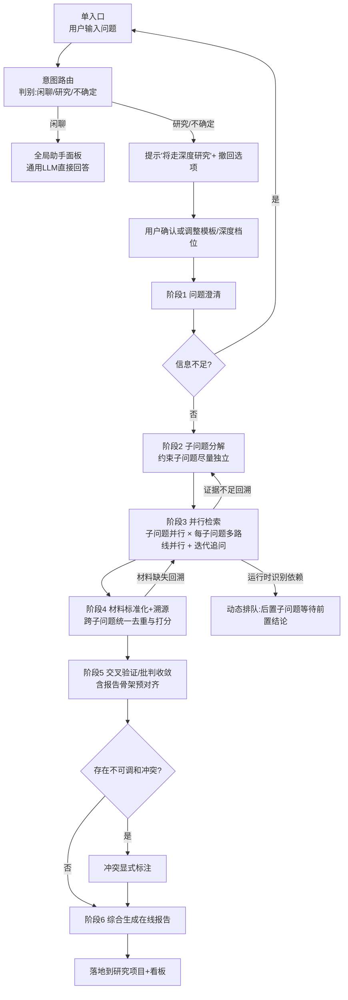
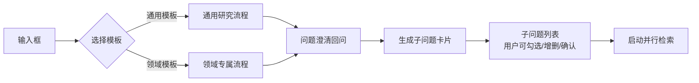
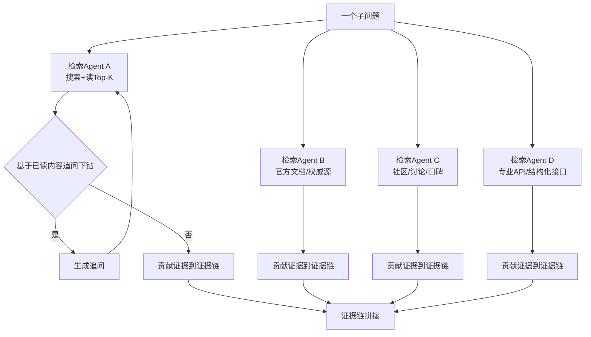
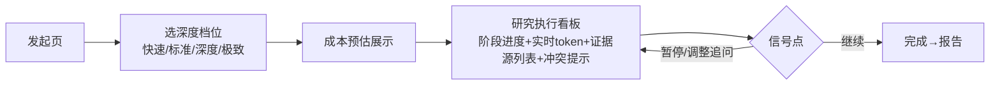
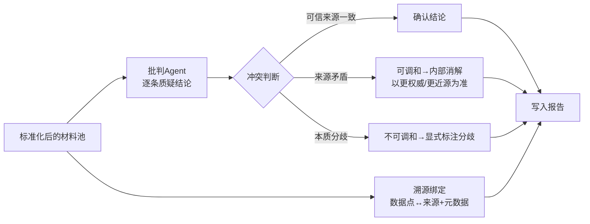
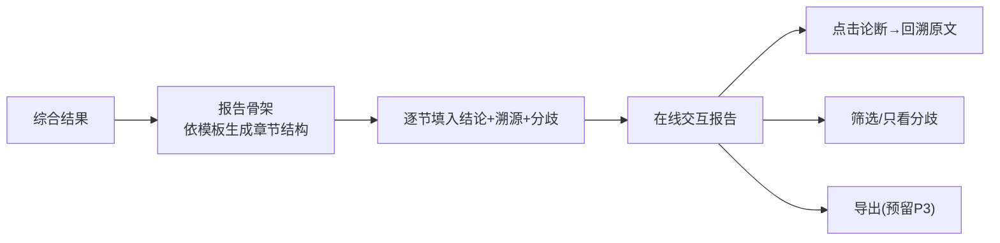

# AI 研究员助手 · 软件需求规格说明书（PRD）

**产品代号**：AI 研究员助手（AI Research Assistant）
**文档版本**：v1.0
**创建日期**：2026-09-08
**状态**：待评审

> 说明：本文描述"做什么"，不描述"怎么实现"（不指定数据库、编程语言、具体技术框架）。技术选型交由架构设计与开发计划（SDP）阶段完成。凡未定数据用 `[待确认]` 标注，凡本文推定内容用 `[假设—需确认]` 标注。

---

## 1. 需求背景

### 1.1 业务背景

在 LLM 时代，用户在 AI 产品上的信息获取诉求正从"单轮问答"升级为"深度研究+知识整合"。单轮对话只能给出一个浅层、及时但不可验证的答案，无法支撑需要严谨证据的决策场景。以下四类企业工作对此尤为突出：

- **投资与行业研究**：分析行业趋势，需要对多源数据做交叉验证
- **技术与架构调研**：对比多个技术方案，需核对官方文档与社区讨论
- **竞品分析**：收集竞品的产品信息、用户评价与市场份额
- **政策解读**：追踪政策原文、官方解读与专家分析

这些场景的共同特征：信息分散在多个来源、需要交叉验证以识别冲突与谣言、需要多步推理形成完整结论、需要可追溯的引用以支持事实核查。传统单轮问答在这些场景下均不成立。

>[专家判断] 现有通用模型（Web 版对话）与单次搜索工具无法满足上述完整研究链路需求，用户在"快速获得文本答案"与"系统化获得可验证结论"之间有明显未满足的进阶需求。市场规模与竞品量化数据见竞争分析章节，标注为 `[待补充—需人工调研]`。

### 1.2 用户现状与痛点

当前用户完成一次深度研究的典型方式：多开浏览器标签，反复搜索、打开页面、人工摘录、手工整理引用、自己判断信源冲突。痛点集中在：

- 信息分散、检索耗时，人工收集占研究时间的主要部分
- 免不了查证成本：为确认一个数字要打开多个来源比对
- 结论难追溯：人工整理的引用经常丢失上下文，无法一键核查
- 知识不沉淀：研究过程和中间证据没有保存，换了任务就重来

### 1.3 不解决会怎样

研究产出效率与质量长期受制于人工，企业决策所依赖的证据链不透明、难以复核。在多选题和主观判断密集的场景（投资、政策、竞品），证据可信度直接决定决策质量。

---

## 2. 产品目标与成功指标

### 2.1 产品定位

**AI 研究员助手**是一套面向企业级多角色研究者的 AI 多智能体深度研究平台。核心差异化在于两点：

- **系统性**：从问题澄清到结论输出的完整研究流程自动编排，而非单次问答
- **结论可信且可溯源**：每个数据点/声明绑定来源及元数据，经受得住事实核查

>[专家判断] 单点问答能力通用模型已经足够，本产品的竞争力必须建立在"完整研究流程的系统化 + 结论可信度"之上，这是通用工具做不了、也难以复制到工作流里的能力。

### 2.2 核心目标（可度量）

| 目标 | 度量标准 | 基线 | 目标值 | 数据依据 |
|---|---|---|---|---|
| 结论可信度 | 用户对报告"信源可回溯率"（随机抽查论断能否追到原文） | `[待确认]` | ≥ 95% | `[待确认]` |
| 研究效率 | 单次标准研究从发起到得到首版报告的人力耗时 | `[待确认]`（对标人工 1 周） | 压到 T+0.5 天 | `[待确认]` |
| 事实准确率 | 抽检论断中无事实性错误的比例 | `[待确认]` | ≥ 90% | `[待确认]` |
| 成本可预期 | 单次研究实际消耗误差率 | `[待确认]` | 预估±15% 内 | `[待确认]` |

> 基线数据企业内尚无统计，需在产品运行后采集。以上为方向性目标，具体数值在迭代首月校准。

### 2.3 北极星指标

将 **"单次研究获得被采用的可信结论"** 作为北极星，即用户真正把系统结论采纳进决策、并认可其可追溯性的比率。该指标依赖长周期人工反馈，V1 阶段（M3-M5）采用可即时采集的**替代指标**驱动迭代：溯源可回溯率、透明看板介入率、报告生成成功率、证据不足子问题占比。过程与质量指标见"数据与指标"章节。

---

## 3. 用户与场景

### 3.1 目标用户画像

| Persona | 熟练度 | 使用频率 | 决策权 | 痛点强度 |
|---|---|---|---|---|
| 投资/行业研究员 | 高（专业查证） | 每周多次 | 直接用于投资结论 | 高 |
| 技术架构师/研发负责人 | 高 | 每周多次 | 影响技术选型 | 高 |
| 咨询顾问/政策分析师 | 高 | 每周多次 | 影响客户交付/政策建议 | 高 |
| 知识管理专员 | 中 | 每日 | 知识库归档 | 中 |
| 团队管理者（Boss） | 中 | 低频 | 审批与分配 | 中 |

### 3.2 角色与职能分离

面向企业的产品需要区分不同角色，使用人、购买人、审批人、管理者常非同一人：

- **研究者（使用人）**：发起研究、在线阅读、校订报告
- **团队管理员**：管理成员、分配预算档位、设定数据权限
- **企业审批人/合规**：审批私域接入、查看审计记录
- **平台运营/部署方**：租户开通、私有化交付

### 3.3 核心场景（按优先级）

**P0 场景**：研究者发起深度研究 → 系统自动规划/检索/批判 → 生成在线报告，全程透明看板可介入。
**P1 场景**：研究报告中"单数据点可溯源"核验；冲突点显式呈现；成本分级与实时展示。
**P2 场景**：企业私域数据接入并做血缘标注；数据源级权限与角色脱敏；报告逐句校订闭环。
**P3 场景**：报告导出 Word/PDF；私有化部署。

### 3.4 使用前提

- SaaS 租户已开通，用户已登录并被分配有效角色
- 选择的执行深度档位对应的算力/额度可用
- 私域数据功能需企业已完成对应连接器的授权

---

## 4. 产品范围与 MVP 界定

### 4.1 范围说明

覆盖四类研究场景的角色，通过**统一研究引擎 + 领域模板配置**来满足，而非为每个场景各建一套独立流程。MVP 只交付一条最深的核心路径便于验证核心命题。

> 注：用户的简单提问/闲聊场景不进入研究引擎，由通用 LLM 直接应答（在独立的全局助手面板中），与"研究项目"区隔。本文档描述的是"深度研究"路径的需求。

### 4.2 MVP 范围（第一版）

**包含：**

- 公域信源检索（网页、新闻、官方文档、社区）
- 完整研究流程：问题澄清 → 子问题分解 → 并行检索 → 材料标准化 → 交叉验证/批判 → 在线报告
- 透明研究看板与成本分档
- 数据点级溯源与冲突显式呈现
- 统一研究引擎 + 通用模板 + 一个示范性领域模板（技术调研/竞品分析）
- 多租户隔离 + 项目级隔离 + 角色权限（数据源级权限后置 P2）

**不包含（后置到 P2/P3）：**

- 企业私域连接器与血缘标注（P2）
- 报告逐句校订闭环（P2）
- 报告导出 Word/PDF（P3）
- 结构化数据资产复用（P2）
- 商业数据库接入（P3）
- 私有化部署（P3）

---

## 5. 功能需求

本章为需求主体。第 5.1 节为功能总表（快速索引），5.2 节起按模块给出功能描述、交互逻辑、约束规则、权限与边界，并配以原型示意图。原型为信息架构级线框图，视觉细节（配色、字号、间距、图标）不在此范围内，交由交互设计与视觉规范阶段。

### 5.1 功能总览表

| # | 模块 | 功能描述 |
|---|---|---|
| 1 | 账号与租户 | 企业租户开通、成员管理、角色分配（研究者/管理员/审批人）。SaaS 多租户隔离，架构预留私有化。 |
| 2 | 研究项目管理 | 研究项目的创建、归档、列表检索；项目内成员共享研究，形成知识沉淀入口。 |
| 3 | 研究规划 | 接收用户问题，先做问题澄清（回问或自动补全），再拆解为可并行的子问题，生成研究计划，用户可查看与调整。 |
| 4 | 深度检索 | 由多个检索型 Agent 并行执行：先搜索再基于结果迭代追问下钻，并并行走多条路线（网页/官方文档/社区/结构化接口），把分散证据拼接成"证据链"。 |
| 5 | 材料标准化与溯源 | 对抓取材料统一抽取来源元数据（域名、发布时间、信源类型、可信分级），去重并按与子问题的相关性打分；将溯源绑定到数据点/声明，附带来源元数据。 |
| 6 | 批判与冲突消解 | 批判 Agent 对结论逐条质疑，可调和的冲突在内部收敛；不可调和的拆分显式呈现给用户判断。 |
| 7 | 报告生成与在线展示 | 综合 5/6 结果生成在线交互式报告：含结论/证据/分歧/局限四类区块，论断可点击回溯原文、冲突点可筛选查看。 |
| 8 | 透明看板与成本治理 | 全程展示"正在检索什么、证据来自哪里、哪里冲突、消耗多少"，可中途暂停调整追问方向；执行深度分档（快速/标准/深度/极致），研究前预估成本，运行中实时展示消耗。 |
| 9 | 权限与隔离 | 多租户隔离 + 项目级隔离（项目内成员可见）+ 角色权限（研究者/管理员/审批人）；数据源级权限与角色脱敏、审计日志后置 P2。 |
| 10 | 模板管理 | 通用研究模板 + 领域模板配置（问题定义、检索策略、报告结构），供运营与管理员维护。 |
| 11 | 意图路由 | 单入口；模型对问题复杂度/多源验证特征打分判别意图（闲聊/研究/不确定）。闲聊走通用 LLM 不进研究引擎；研究路径自动启动并提示用户，UI 支持"撤回为闲聊"与"手动强制深度"。 |

> 备注：企业私域连接与血缘标注、报告逐句校订、报告导出、数据资产、商业库对接、私有化为演化功能，不在 MVP，详见"迭代规划"。

---

### 5.2 模块详情与原型

#### 模块 A · 一次深度研究的整体流程（贯穿型）

这是全系统的骨架，其它模块挂在它的各阶段上。流程图如下：

**6 阶段 I/O 与产物**：

| 阶段 | 输入 | 产物（输出） | 关键约束 |
|---|---|---|---|
| 1 问题澄清 | 用户问题 | 澄清后的问题结构化描述 | 信息不足必须回问（≤1 轮）；超时默认假设 |
| 2 子问题分解 | 澄清后问题 + 模板 | 子问题列表 + 依赖图 | 子问题尽量独立；显式标注依赖供运行时动态排队 |
| 3 并行检索 | 子问题 + 档位参数 | 证据池（每子问题一份） | 档位决定轮数/并行度；禁止未抓取的摘要作事实 |
| 4 材料标准化 | 证据池 | 标准化材料池（带元数据、可信分级、去重打分） | 跨子问题统一清洗；为溯源与批判提供原料 |
| 5 批判收敛 | 标准化材料池 + 报告骨架预对齐 | 已收敛结论集 + 显式分歧集 + 报告骨架 | 收敛上限：达档位 token 预算的 x%（默认 30，`[待确认]`）即停 |
| 6 在线报告生成 | 阶段5产物 + 模板骨架 | 在线交互式报告（结论/证据/分歧/局限） | 四类区块强约束；引用与溯源组件不可绕开 |

**业务逻辑**：研究按"澄清 → 分解 → 检索 → 标准化 → 批判 → 综合"的主线推进。主干保持清晰的 6 阶段进度条用于向用户展示（可解释、可监控）；检索和标准化阶段内部允许"证据不足→回溯补检索"的循环；子问题运行时如出现新依赖，将依赖图更新的子问题排到前置结论产出后；保证研究的深度同时维持并行度。全流程结果沉淀到对应研究项目。

**交互逻辑**：用户在发起页提交问题与参数 → 路由自动判别 → 若将走深度研究，给出确认提示与撤回选项 → 进入实时看板，看到阶段进度、当前检索主题、已收集证据来源、实时 token 消耗 → 可在"检索中"暂停并追加/调整追问方向 → 完成后进入在线报告页。

**约束规则**：每个阶段必须在上游前序产物存在时才能推进；若无证据记录则视为检索不充分，禁止进入批判阶段；人到终态前，报告不可用于"最终结论"标识；闲聊路径产物不进入研究项目。

**权限**：研究者可发起与查看自己的研究；项目内成员可查看同项目研究；项目外不可见（见模块 E）。

**边界与异常**：检索阶段网络超时自动重试；最终无有效证据时明确提示"证据不足"并允许调整问题重跑；并发冲突（同一项目多用户同时编辑）以后到者提示覆盖；意图判别不确定时按"研究"默认并给撤回选项。

#### 模块 B · 研究发起与规划（功能#2、#3）

**业务逻辑**：用户提交一个宽泛问题后，系统先判断信息是否足以澄清任务边界；不足时以回问形式（附带推荐选项）补齐缺口。随后将问题分解为若干可并行子问题，形成研究计划卡片列表，用户可确认、增删、调整顺序后启动。

**交互逻辑**：提交问题 → 若需澄清，弹出澄清卡（2~4 个选项 + 推荐默认）→ 确认后进入子问题计划页 → 点"启动研究"进入看板（模块 D）。任一环节可返回修改。

**约束规则**：问题非空且长度 ≤ 500 字；模板决定子问题拆分策略与报告骨架；澄清回问最多一轮（超过则采用默认假设并标注）。深度档位决定后续并行度上限（见模块 D）。

**权限**：只有项目成员能在该项目内发起研究。

**边界与异常**：空问题给出占位引导；模板无匹配时回退通用模板并提示。

#### 模块 C · 深度检索（功能#4）

**业务逻辑**：每个子问题由一个（或一组）检索 Agent 负责，基于模型底座做"搜索 → 读内容 → 基于已读内容迭代追问下钻"，直到证据链满足该子问题的覆盖要求；同时并行走多条来源路线（综合搜索、官方文档/权威源、社区/口碑、专业 API/结构化接口），把分散证据拼接成文档化的证据链。此处的"深度"，来源于迭代追问能追到具体数据/政策文号/原文级信息，而非只拿到一次搜索的摘要。

**交互逻辑**：检索阶段不要求用户逐点操作；在透明看板可见当前组子问题及各自进度。用户可在检索中追加追问方向（见模块 D 暂停能力）。

**约束规则**：每子问题检索轮数以上限挡板控制（档位决定，见模块 D）；必须记录每次检索的原始 URL 与抓取内容，供溯源；禁止直接采用未经抓取的检索摘要作为事实依据。

**权限**：检索范围受数据源权限约束（MVP 仅公域）。

**边界与异常**：单源抓取失败重试 2 次后降级跳过并在看板标注"来源抓取失败"；所有路线均无有效内容时，该子问题标记"证据不足"，进入批判阶段时按弱证据处理并要求用户补充。

#### 模块 D · 透明看板与成本治理（功能#8）

**业务逻辑**：提供"深度档位"作为成本治理的核心控件，每一档定义检索轮数、并行度、token 上限（为产品安全的档位映射，具体数值策略见 6.4 成本治理）。发起前预估本次研究成本；执行看板实时展示已消耗 token 与当前档位剩余额度，以及各阶段进度、证据来源清单与冲突提示。

**交互逻辑**：用户选档 → 看到成本预估与预计耗时 → 同意后进入看板 → 看板实时刷新；支持"暂停"→ 追加/调整追问方向 →"继续"；达到档位上限时自动降级或提示手动扩容。

**约束规则**：档位是用户可选的强制参数，不可省略；token 与并发上限必须可配置（运营侧）；逾档必须明确提示，不得静默超支。

**权限**：管理员可配置各档位默认上限；研究者只能在自己权限范围内选用档位。

**边界与异常**：实时数据刷新延迟 ≤ 3 秒；成本接口失败时展示最近一次快照并标注"数据可能滞后"；暂停超过 15 分钟自动保持状态并要求确认再续。

#### 模块 E · 溯源与批判收敛（功能#5、#6）

**业务逻辑**：每一个数据点/结论声明都绑定其来源及元数据（来源域名、发布时间、类型、可信分级），支持单点回溯到原始片段。批判 Agent 针对"结论可信度"的工作分两类：一类是对生成的每个论断逐条质疑并校验来源，能收敛的冲突依据"更权威或更近源"的规则在内部消解；另一类是来自不同统计口径、不同立场、无法调和的分歧，系统不强行抹平，而是把它作为报告的一部分显式呈现，交由用户判断。这种"内部分解+外显分歧"的处理既保证可信度，也贴合研究员诚实呈现证据的作业习惯。

**交互逻辑**：在报告页，每个论断带"来源角标"，点击跳转子面板查看来源清单与元数据；有分歧处高亮并列出各方证据，用户可勾选"采纳/存疑/忽略"作为个人偏好记录（P2 供校订闭环使用）。

**约束规则**：未绑定来源的论断不得作为"事实"呈现，只能标识为"推断"；可信分级字段必填；同数据点来源数 ≥2 才允许判定"已交叉验证"。

**权限**：溯源信息（包括内部材料来源）仅项目成员可见；涉及脱敏数据的来源在展示层打码（P2 起）。

**边界与异常**：来源元数据缺失时标记"来源信息不全"；脱网/无来源场景下结论标记为"推断"并降低可信分级；批判循环以消耗预算占比为收敛上限（达到当前深度档位 token 预算的 x% 即结束，默认 x=30，`[待确认]`），防止死循环与成本失控。

#### 模块 F · 报告生成与在线展示（功能#7）

**业务逻辑**：依据所选模板的报告结构，将综合结论、数据点溯源、显式分歧组装成在线交互式报告。报告是研究产出的主要载体，存放于研究项目内，支持后续访问与复用。

**交互逻辑**：报告页左侧为章节目录，正文每个论断带来源角标，顶部提供"只看分歧/只看已交叉验证"等筛选视图（MVP 至少提供分歧筛选）。内置研究对象与时间范围等元数据头信息。

**约束规则**：报告必须包含"结论、证据、分歧、局限（证据不足处）"四类区块，缺一不可；引用与溯源组件为强约束，不允许纯文本报告绕过。

**权限**：项目内成员可查看；导出权限受租户配置控制（P3 落地时细化）。

**边界与异常**：报告体量超过展示上限时按章节分页或折叠；生成失败时保留阶段产物并给出可重试入口，不丢中间数据。

#### 模块 G · 意图路由（功能#11）

**业务目标**：解决"用户输入一句话，到底走闲聊还是深度研究"的入口分流问题，避免把闲聊误跑成多 Agent 深度流程造成资源浪费、避免把本应深研的问题当闲聊草草回答。

**路由规则**：
- 判别维度：问题长度、具体性、含研究关键词（"对比/趋势/分析/综述/最新"等）、是否需多源验证、是否含可检索实体
- 判别结果：闲聊 / 研究 / 不确定
- 不确定时默认走"研究"并给用户撤回选项（保守策略：避免漏掉深度需求）
- 用户可在 UI 手动"强制闲聊"或"强制研究"，绕过自动判别

**交互逻辑**：
- 用户在单入口输入框输入问题
- 系统返回判别结果 + 推荐路径
- 若将走研究：弹出"将启动深度研究"提示，可调整模板与深度档位，有"改回闲聊"按钮
- 若走闲聊：进入全局助手面板，直接得到回答；不沉淀到研究项目
- 全过程 ≤ 2 秒（`[待确认]`）反馈判别结果，避免用户长时间等待

**边界与异常**：判别耗时过长时降级为"研究"并提示用户；LLM 路由调用失败时回退为"研究"（保守）+ 显式说明。

**接口要点（给研发）**：
- 输入：用户原始问题文本 + 用户上下文
- 输出：意图分类（闲聊/研究）+ 置信度 + 推荐参数（默认模板、默认档位）
- 数据流向：研究路径触发模块 A 入口；闲聊路径独立全局助手面板

---

## 6. 非功能需求

### 6.1 AI 结果质量与评估

准确度按任务维度定义：**正确性**（事实无错）、**完整性**（覆盖子问题）、**相关性**（证据对得上结论）、**可溯性**（论断都能回溯到来源）、**可执行性**（技术/竞品类结论可被直接采用）、**稳定性**（同题多轮结果不显著漂移）。

评估体系：

- **离线评估**：建设标准样例集（覆盖四类场景）、边界样例（信息矛盾、来源缺失、长尾主题）、负面样例（易引发幻觉的提问）与回归样例。评分维度含结构完整、逻辑一致、溯源完整、可采纳度。此为工程侧质量门禁，工具可复用；
- **人工评审**：研究员对报告打分（正确性/完整/溯源），沉淀坏例进入回归集；
- **在线反馈**：统计用户行为（采纳、修改、复制、再问、放弃），生成后"再来一次/修改"入口，支持用户对结论赞/踩并提交原因。

**准入/阻断标准（go/no-go）**：准确率、可溯性、成本、时长、安全与合规五项均达标才允许全量发布（数值 `[待确认]`，在迭代校准）。

### 6.2 性能

- 报告页首帧加载 ≤ 2s；看板实时数据刷新延迟 ≤ 3s
- 标准档单次研究全程尽力在可接受窗口内完成（目标 T+30 分钟内出稿，`[待确认]`，受信源与档位影响）
- 并发：每租户同时运行研究的最大并行数受档位与算力配额约束，超限排队

### 6.3 安全与合规

- 数据传输与存储加密（传输 TLS，存储加密 `[待确认]`）
- 多租户数据隔离（项目级为最小隔离单元）
- 管理员支持角色与数据源权限配置
- 预留审计日志：记录"谁在什么时间访问了哪些数据、这些数据进入了哪些报告"（P2 起）
- 骚乱/敏感内容与版权风险：检索内容仅用于生成，输出侧不直接复制整页；涉政/金融合规细节 `[假设—需企业法务或合规确认]`
- 数据脱敏规则 `[待确认]`，依企业实际数据分类分级而定

### 6.4 成本治理

成本是按量计费的商业化核心参数，与体验耦合：

| 档位 | 定位 | 检索轮次（每子问题） | 并行子问题数 | token 上限（每次研究） | 预估单次成本档 |
|---|---|---|---|---|---|
| 快速 | 有初步了解即可 | ≤ 3 | ≤ 2 | 50k | 最低 |
| 标准（默认） | 日常研究 | ≤ 5 | ≤ 4 | 150k | 中 |
| 深度 | 严谨论证/决策依据 | ≤ 8 | ≤ 6 | 400k | 高 |
| 极致 | 全面尽调级 | ≤ 12 | ≤ 8 | 1M | 最高 |

> 以上为**建议默认值**（`[待确认]`），在迭代首月按实测校准；各数字须可在运营后台按租户配置覆盖。

内存/算力配额由运营后台配置按租户生效。研究前预估、运行时实时达标提示，达档自动提示扩容或降级，杜绝静默超支。

### 6.5 可用性与容错

- 检索依赖的外部信源不可控：单源失败重试，无法恢复时降级并标注
- 关键中间状态（每阶段产物、原始证据、溯源记录）在各阶段结束时持久化，崩溃后可续跑
- 服务可用性（SLA）随定价分级，`[待确认]`

### 6.6 可扩展性与交付形态

SaaS 先行的架构需为私有化预留断点（数据分片、连接器抽象、部署边界），使后续私有化不重构。多场景通过模板配置扩展，不新写一套流水线。

---

## 7. 数据与指标

> 指标用于回答"系统是否成立"，所有埋点需说明服务何种决策。

- **北极星**：单次研究获得被采用的可信结论的比率
- **过程指标**：发起→规划→启动转化、检索完成率、看板介入率、暂停/续跑事件
- **质量指标**：溯源可回溯率、论断准确率（人工抽检）、证据不足子问题占比、冲突显式呈现数量与采纳情况
- **成本指标**：单次研究实际/预估误差率、各档位平均成本与时长
- **商业指标**：激活率、留存、每租户研究量、付费转化、续订（具体基线 `[待确认]`）

埋点须区分"指标"（观察什么）与"采集"（怎么收集）；每个事件明确服务哪个决策（如"看板介入率"服务于判断透明看板是否真的帮助用户信任系统）。

---

## 8. 依赖、风险与里程碑

### 8.1 依赖

**技术**：LLM 推理服务（多模型可替换）、多 Agent 编排底座、检索与抓取服务、向量化与索引、对象/文档存储、多租户账户体系、成本计量计费服务。
**团队**：产品、算法/模型、后端、前端、设计、QA、SRE 算力运营、法务合规。
**外部**：公网搜索与正文抓取能力（第三方搜索 API、网页抓取合规）、权威源/文档站点可访问性、企业私域连接器生态（P2 起）、商业数据库（P3 起，可选）。

### 8.2 风险与应对

| 风险 | 概率 | 影响 | 应对 |
|---|---|---|---|
| LLM 幻觉/事实错误 | 高 | 高（可信度根基） | 溯源 + 批判 + 交叉验证强制约束；口径一致采样离线评估 |
| 成本失控 | 高 | 高 | 深度档位 + 实时展示 + 上限配置 |
| 公域抓取受限（反爬/版权） | 中 | 中 | 冷却策略、权威源直连、合规评估 |
| 结论争议/版权/敏感内容风险 | 中 | 高 | 显式呈现分歧、不整页复制、法务合规确认 |
| 用户过度信任 AI 结论 | 中 | 高 | 区分"事实/推断"、证据不足提示、理性引导文案 |
| 企业级权限/审计落地不足 | 中 | 高 | 项目级隔离先行、审计日志纳入 P2 硬范围 |
| AI 内核不稳定/可用性 | 中 | 中 | 模型多供应商可替换、SLA 分级 |

### 8.3 里程碑

> 里程碑的绝对时间取决于团队与算力资源，此处只给阶段与交付物，不承诺日期 `[待确认]`。
> 里程碑的阶段划分、交付物与验收准则由《AI研究者助手-软件开发计划》（SDP §3）统一维护，本文档不重复定义阶段编号，避免双基线漂移。

**发布阶段与 SDP 的对应关系**：

- SDP **M3（核心 MVP）** 交付本文档 §4.2 定义的 V1（MVP）范围，验收以 §11 验收清单（A1-A14）中 M3 对应项为准（对齐关系见 SDP §5.2）
- SDP **M4（体验打磨）/ M5（私域能力）** 对应本文档 §9 的 V2 演进（私域连接器、审计日志等）
- SDP **M6（SaaS GA）** 及之后对应 V3（报告导出、商业数据库、私有化部署）

里程碑级别的发布节奏（MVP 联调 → 内测评估 → 灰度发布 → 正式发布）由 SDP 结合资源排期给出，本文档仅约束"每个发布版本必须覆盖的功能范围与验收项"。

---

## 9. 迭代规划

**MVP（V1）**：公域检索 + 完整研究流程 + 透明看板 + 成本分档 + 数据点溯源 + 冲突显式呈现 + 通用模板/技术竞品示范模板 + 多租户与项目级隔离、角色权限。
**V2**：企业私域连接器与血缘标注、报告逐句校订闭环、结构化数据资产复用、审计日志。
**V3**：报告导出 Word/PDF、商业数据库接入、面向政企/金融的私有化部署与定制模板。

---

## 10. 数据实体关系

用于说明核心业务对象之间的归属与复用逻辑，供研发与 QA 对齐模型与权限设计。

| 实体 | 主要字段（关键项） | 归属 | 与其它实体的关系 |
|---|---|---|---|
| 租户 Tenant | 名称、结算档位、配额 | 平台 | 1-N 用户；1-N 项目 |
| 用户 User | 账号、角色 | 租户 | N-1 租户；N-N 项目（成员） |
| 项目 Project | 名称、负责人、可访问成员 | 租户 | 1-N 研究 |
| 研究 Research | 问题、模板、深度档位、6 阶段状态、成本记录 | 项目 | N-1 项目；1-N 子问题；1-1 报告 |
| 子问题 SubProblem | 问题文本、状态、证据链引用 | 研究 | N-1 研究；N-N 材料 |
| 证据/材料 Evidence | 来源 URL、发布时间、类型、可信分级、抓取内容 | 子问题 | N-N 子问题；N-N 数据点 |
| 数据点/声明 DataPoint | 断言文本、可信判别、是否已交叉验证 | 报告 | N-N 证据（溯源） |
| 报告 Report | 模板类型、结论/证据/分歧/局限区块、生成时间 | 研究 | 1-1 研究；1-N 数据点 |
| 模板 Template | 类型、问题定义、检索策略、报告结构 | 平台 | 1-N 研究 |
| 意图判别记录 IntentLog | 输入文本、判别结果（闲聊/研究/不确定）、置信度、时间 | 租户 | N-1 租户（仅供路由模型迭代与回溯审计） |
| 闲聊会话 ChatSession | 用户、消息列表 | 用户 | N-1 用户（不挂项目） |

**归属逻辑**：数据隔离的最小边界为租户，其次为项目。研究、子问题、证据、数据点、报告均归属到具体项目，非项目成员不可见。证据与数据点跨研究复用的能力（数据资产）为 P2。闲聊会话仅归属到本人用户，不进入项目沉淀；意图判别记录用于路由模型迭代，不挂业务展示。

## 11. 需求验收清单

供 QA 与研发作为首次交付的底线检查项，通过后才算 MVP 完成。数值阈值以 `[待确认]` 为准。

| # | 验收项 | 判定 |
|---|---|---|
| A1 | 能从公网发起一次标准档研究并生成在线报告 | 端到端跑通闭环 |
| A2 | 报告每个论断可点击回溯到原始来源 URL 与片段 | 抽样 ≥ 10 个论断全部可回溯 |
| A3 | 存在"结论/证据/分歧/局限"四类区块 | 完整呈现 |
| A4 | 冲突点显式呈现且可筛选查看 | 有分歧样例时可见 |
| A5 | 透明看板展示阶段进度、证据源、实时 token | 达标率与口径正确 |
| A6 | 深度档位限制生效，不出现静默超支 | 触发上限时明确降级/提示 |
| A7 | 多租户与项目级隔离成立 | A 租户/项目不可见 B 的数据 |
| A8 | 溯源可回溯率、看板介入率、报告生成成功率可采集 | 埋点可出数 |
| A9 | 证据不足子问题有显式提示，不冒充事实 | 边界样例通过 |
| A10 | 标准档单次研究在可接受时长内完成 | 满足性能目标 |
| A11 | 闲聊类输入被自动判别为闲聊，不进入研究引擎 | 闲聊样例集召回 ≥ 95% |
| A12 | 研究类输入被自动判别为研究，能走完整 6 阶段 | 研究样例集召回 ≥ 95% |
| A13 | 不确定时默认走研究并给撤回选项 | 撤回操作可逆、不污染研究项目 |
| A14 | 闲聊会话不沉淀进研究项目 | 闲聊回答与研究项目互不可见 |

---

## 附：待确认/假设清单

- `[待确认]`：各项指标基线（准确率、时长、成本、SLA、加密/合规/脱敏细则）；成本档位默认值（检索轮次/并行数/token 上限）；批判收敛预算占比；意图路由判别阈值/耗时上限/召回目标；需求验收表中各项数值阈值
- `[待补充—需人工调研]`：竞品与市场规模量化数据，见下方竞争分析章节方向
- `[假设]`：多角色共享平台的价值假设（统一引擎+领域模板）、MVP 从公域单路径起步的取舍、技术调研/竞品分析作为示范模板的优先级

---

### 竞争分析方向（待人工调研补充）

> 此处不虚构竞品数据，仅给出应调研的分析框架与候选对象，具体数值待补充 `[待补充—需人工调研]`。

**候选对象**：Deep Research 类功能（头部通用模型厂商）、企业知识库+检索增强类产品、专门的 agent 研究工具、传统研究/尽调软件。应对比维度：是否支持完整研究流程、溯源颗粒度、成本控制、企业权限与私有化、价格与规模化。
**结论方向（判断）**：通用模型的 Deep Research 在"深度检索"上有雏形，但缺乏企业级可溯源、成本治理、数据隔离与私域混合信源；这正是本产品的差异化机会。